<div align="center">

# 🛸 OrbitGO

#### Multichain Treasury Dashboard

[](https://opensource.org/licenses/MIT)
[](https://github.com/calpa)

🚀 A permissionless, plug-and-play multichain treasury dashboard for Web3 treasury managers.

📊 Real-time visualizations · 💰 Yield tracking · ⛓️ Cross-chain insights

[Getting Started](#-getting-started) · [Features](#-key-features) · [Documentation](#-documentation) · [Contributing](#-contributing)

</div>

## 🌟 Key Features

### 🔄 Real-time Portfolio Tracking

- **Multi-Chain Support**: Track tokens across Ethereum, Arbitrum, Base, Kaia, Optimism, and Polygon
- **Token Terminal**: Comprehensive token viewing interface with smart filtering and beautiful UI
- **Webhook Management**: Create and manage webhooks for token tracking with real-time status monitoring

### 📊 Advanced Analytics

- **Chain Distribution**: Visual breakdown of assets across different blockchains
- **Protocol Allocation**: Interactive charts showing protocol-level distribution
- **Yield Tracking**: Monitor APR and performance across protocols

### 💡 Smart Features

- **Permissionless Access**: No registration required, just connect your wallet
- **Data Export**: Export transaction history and portfolio data to CSV
- **Real-time Updates**: Automatic data refresh with manual refresh option

### 🎨 User Interface

- **Token Details**: View token balances, symbols, and contract addresses
- **Smart Filtering**: Automatically filter out suspicious or spam tokens
- **Chain Icons**: Beautiful chain and token icons with fallback displays
- **Responsive Design**: Optimized for both desktop and mobile viewing

### 🔗 Webhook Features

- **Multi-Address Support**: Add multiple addresses to a single webhook
- **Network Selection**: Choose from multiple supported networks
- **Status Monitoring**: Track webhook status and activity
- **Easy Management**: Create, view, and manage webhooks through a simple interface

## 🚀 Getting Started

### Prerequisites

- Node.js 18+
- npm or yarn
- Web3 wallet (MetaMask, Rainbow, etc.)
- Environment variables (see below)

### Installation

```bash
# Clone the repository
git clone https://github.com/calpa/treasury-management-frontend.git

# Install dependencies
npm install

# Set up environment variables
echo 'VITE_API_URL=https://treasury-management-backend.calpa.workers.dev' > .env

# Start development server
npm run dev
```

## 📁 Project Structure

```
src/
├── components/          # Reusable UI components
│   ├── BalanceCard/     # Chain balance display
│   └── webhooks/        # Webhook management components
├── routes/              # Application routes
│   └── dashboard/       # Main dashboard views
│       ├── chains/      # Token terminal views
│       └── notifications/ # Webhook management views
├── utils/              # Utility functions
│   ├── chains.ts       # Chain utilities
│   └── format.ts       # Formatting utilities
├── constants/          # Configuration constants
│   ├── chains.json     # Chain definitions
│   └── networks.ts     # Network configurations
└── types/             # TypeScript type definitions
    ├── chain_details.ts # Chain and token types
    └── webhooks.ts     # Webhook types
```

## 💾 Backend Integration

The application uses Cloudflare Workers as the backend API:

```typescript
// Base URL
const BASE_URL = 'https://treasury-management-backend.calpa.workers.dev'

// Key Endpoints
POST /token/:protocol/:network/tokens/owned  // Get owned tokens for a protocol
GET  /webhook/webhooks                       // List all webhooks
POST /webhook                                // Create a new webhook

// API Features
- Token balance tracking
- Multi-chain support
- Webhook management
- Smart token filtering

// Cloudflare Workers Features
- Rate limiting
- Response caching
- CORS handling
- Error handling
```

## 🛠️ Tech Stack

<table>
  <tr>
    <th>Category</th>
    <th>Technologies</th>
  </tr>
  <tr>
    <td>Core</td>
    <td>
      
      
      
    </td>
  </tr>
  <tr>
    <td>Styling</td>
    <td>
      
      
    </td>
  </tr>
  <tr>
    <td>State & Data</td>
    <td>
      
      
      
    </td>
  </tr>
  <tr>
    <td>Web3</td>
    <td>
      
      
    </td>
  </tr>
</table>

### Core

- **Framework**: React 19 with TypeScript
- **Build Tool**: Vite 6
- **Styling**: TailwindCSS 4
- **State Management**: TanStack Query + Jotai
- **Routing**: TanStack Router

### Data & Visualization

- **Charts**: Recharts
- **Data Grid**: AG Grid
- **Icons**: Iconify
- **Animations**: Framer Motion
- **Web3**: RainbowKit + wagmi v2

### Development

- **Linting**: ESLint
- **Formatting**: Prettier
- **Testing**: Vitest (planned)

## 🔐 Security

- 1inch API keys are securely stored in Cloudflare Workers
- Environment variables for local development
- Rate limiting protection via Cloudflare Workers
- No sensitive data stored in frontend
- All data processing happens client-side
- Secure wallet connections via RainbowKit

## 🤝 Contributing

1. Fork the repository
2. Create your feature branch (`git checkout -b feature/AmazingFeature`)
3. Commit your changes (`git commit -m 'Add some AmazingFeature'`)
4. Push to the branch (`git push origin feature/AmazingFeature`)
5. Open a Pull Request

## 🏗️ Architecture

```mermaid
flowchart TB
    subgraph Frontend["💻 Frontend - React + TypeScript"]
        UI["🎨 UI Components"]
        Router["🛣️ TanStack Router"]
        Query["📊 TanStack Query"]
        Web3["🔌 wagmi v2"]
    end

    subgraph Backend["☁️ Cloudflare Workers"]
        Cache["💾 Cache Layer"]
        RateLimit["🚦 Rate Limiter"]
        TokenAPI["🔗 Token API"]
        WebhookAPI["💬 Webhook API"]
    end

    subgraph Features["✨ Features"]
        Tokens["Token Terminal"]
        Webhooks["Webhook Management"]
        Filtering["Smart Filtering"]
    end

    subgraph Networks["⛓️ Supported Networks"]
        ETH["Ethereum"]
        ARB["Arbitrum"]
        BASE["Base"]
        KAIA["Kaia"]
        OP["Optimism"]
        POLY["Polygon"]
    end

    User["👤 User"] --> Frontend
    Frontend --> Backend
    Backend --> Features
    Features --> Networks
    Networks --> Backend
    Backend --> Frontend
```



## 📝 TODO: Future Enhancements

### Core Features

- [x] Multi-chain token tracking
- [x] Smart token filtering
- [x] Webhook management
- [ ] Token price tracking
- [ ] Token transfer history

### Token Terminal

- [x] Token balance display
- [x] Chain selection interface
- [x] Spam token filtering
- [ ] Token search functionality
- [ ] Token sorting options

### Webhook System

- [x] Multi-address support
- [x] Network selection
- [x] Status monitoring
- [ ] Webhook event history
- [ ] Custom notification options

## 💡 Development Tips

1. Use environment variables for configuration
2. Run tests before submitting PRs
3. Follow the existing code style and conventions
4. Keep components small and focused
5. Document new features and API changes

## 📝 License

This project is licensed under the MIT License - see the [LICENSE](LICENSE) file for details.

Copyright (c) 2025 Calpa Liu
