<div align="center">

# 🛸 OrbitGO

#### Multichain Treasury Dashboard

[](https://opensource.org/licenses/MIT)
[](https://github.com/calpa)

🚀 A permissionless, plug-and-play multichain treasury dashboard for Web3 treasury managers.

📊 Real-time visualizations · 💰 Yield tracking · ⛓️ Cross-chain insights

[Getting Started](#-getting-started) · [Features](#-key-features) · [Documentation](#-documentation) · [Contributing](#-contributing)

</div>

## 🏗️ Architecture

```mermaid
flowchart TB
    subgraph Frontend["🖥️ Frontend - React 19"]
        UI["🎨 UI Components"]
        Router["🛣️ TanStack Router"]
        State["📦 State Management"]
        Web3["🔌 Web3 Integration"]
    end

    subgraph Backend["☁️ Cloudflare Workers"]
        Cache["💾 Cache Layer"]
        RateLimit["🚦 Rate Limiter"]
        Aggregator["🔄 Data Aggregator"]
    end

    subgraph Blockchain["⛓️ Blockchain Networks"]
        ETH["Ethereum"]
        ARB["Arbitrum"]
        OP["Optimism"]
        BSC["BSC"]
        BASE["Base"]
    end

    User["👤 User"] --> Frontend
    Frontend --> Backend
    Backend --> Blockchain
    Blockchain --> Backend
    Backend --> Frontend
```



## 🌟 Key Features

### 🔄 Real-time Portfolio Tracking
- **Cross-chain Monitoring**: Track assets across Ethereum, Arbitrum, Optimism, Base, BSC, Polygon, and more
- **Protocol-level Analytics**: View positions in DeFi protocols with real-time USD valuations
- **Historical Performance**: Track portfolio value changes over customizable time periods

### 📊 Advanced Analytics
- **Chain Distribution**: Visual breakdown of assets across different blockchains
- **Protocol Allocation**: Interactive charts showing protocol-level distribution
- **Yield Tracking**: Monitor APR and performance across protocols

### 💡 Smart Features
- **Permissionless Access**: No registration required, just connect your wallet
- **Data Export**: Export transaction history and portfolio data to CSV
- **Real-time Updates**: Automatic data refresh with manual refresh option

### Data Visualization
- **Protocol Allocation Chart**: Interactive pie chart showing asset distribution across protocols
- **Total Value Overview**: Real-time summary of total portfolio value and protocol count
- **Chain Distribution**: Detailed breakdown of assets by blockchain
- **Custom Filtering**: Filter protocols by chain, value, and other parameters

### Data Export
- **CSV Export**: Export protocol data with customizable fields
- **Formatted Data**: Well-structured exports including Protocol, Chain, Value (USD), ROI, and APR

## 🚀 Getting Started

### Prerequisites
- Node.js 18+
- npm or yarn
- Ethereum wallet (MetaMask, Rainbow, etc.)

### Installation
```bash
# Clone the repository
git clone https://github.com/your-username/treasury-management-frontend.git

# Install dependencies
npm install

# Set up environment variables
cp .env.example .env
# Edit .env with your API key

# Start development server
npm run dev
```

## 📁 Project Structure
```
src/
├── components/          # Reusable UI components
│   ├── YieldCard/       # Protocol yield display
│   └── ProtocolAllocationChart/  # Portfolio visualization
├── routes/              # Application routes
│   └── dashboard/       # Main dashboard views
├── utils/              # Utility functions
│   ├── csv.ts          # CSV export utilities
│   ├── protocol.ts     # Protocol data processing
│   └── export.ts       # Export formatting
├── constants/          # Configuration constants
│   └── chains.ts       # Chain definitions
└── types.ts           # TypeScript type definitions
```

## 🔌 Backend Integration

OrbitGO uses Cloudflare Workers as the API backend:

```typescript
// Base URL
const BASE_URL = 'https://treasury-management-backend.calpa.workers.dev'

// Key Endpoints
GET /portfolio/:address         // Portfolio overview
GET /portfolio/:address/value-chart  // Historical value data

// Features
- Rate limiting
- Response caching
- Cross-chain data aggregation
```

## 🛠️ Tech Stack

<table>
  <tr>
    <th>Category</th>
    <th>Technologies</th>
  </tr>
  <tr>
    <td>Core</td>
    <td>
      
      
      
    </td>
  </tr>
  <tr>
    <td>Styling</td>
    <td>
      
      
    </td>
  </tr>
  <tr>
    <td>State & Data</td>
    <td>
      
      
      
    </td>
  </tr>
  <tr>
    <td>Web3</td>
    <td>
      
      
    </td>
  </tr>
</table>

### Core
- **Framework**: React 19 with TypeScript
- **Build Tool**: Vite 6
- **Styling**: TailwindCSS 4
- **State Management**: TanStack Query + Jotai
- **Routing**: TanStack Router

### Data & Visualization
- **Charts**: Recharts
- **Data Grid**: AG Grid
- **Icons**: Iconify
- **Animations**: Framer Motion
- **Web3**: RainbowKit + wagmi v2

### Development
- **Linting**: ESLint
- **Formatting**: Prettier
- **Testing**: Vitest (planned)

## 🔐 Security

- API keys are stored in environment variables
- All data processing happens client-side
- Secure wallet connections via RainbowKit

## 🤝 Contributing

1. Fork the repository
2. Create your feature branch (`git checkout -b feature/AmazingFeature`)
3. Commit your changes (`git commit -m 'Add some AmazingFeature'`)
4. Push to the branch (`git push origin feature/AmazingFeature`)
5. Open a Pull Request

## 📝 License

MIT License - see the [LICENSE](LICENSE) file for details

## 📝 TODO: Future Enhancements

### Core Features
- [x] Cross-chain portfolio tracking
- [x] Protocol-level analytics
- [x] Historical value charts
- [ ] Token-level breakdown
- [ ] Portfolio alerts

### Analytics & Reporting
- [x] Chain distribution view
- [x] Protocol allocation charts
- [x] CSV data export
- [ ] Custom date range analytics
- [ ] Performance benchmarking

### User Experience
- [ ] Portfolio alerts and notifications
- [ ] Custom portfolio comparison tools
- [ ] Enhanced analytics dashboard
- [ ] Mobile-responsive design improvements

## 💡 Development Tips

1. Use environment variables for configuration
2. Run tests before submitting PRs
3. Follow the existing code style and conventions
4. Keep components small and focused
5. Document new features and API changes

## 📝 License

This project is licensed under the MIT License - see the [LICENSE](LICENSE) file for details.

Copyright (c) 2025 Calpa Liu
